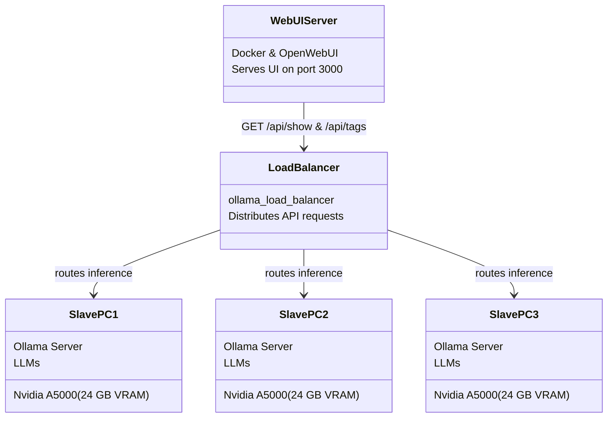

# LLM on Internal Network

Let's say you're on an offline network, and you have multiple PCs on the network that have Nvidia GPUs with at least 24 gigabytes of VRAM each.

You can't use [ChatGPT](chat.openai.com) how sad😭\
Now you can set up your own AI chatbot for coding on your internal network!

We're gonna use: `codestral:22b`,  `qwq:32b` and `gemma3:27b-it-q4_K_M`, all models running on Ollama. We're gonna setup OpenWebUI, and `load_balancer` created by BigBIueWhale, and `llm_server_windows` script suite created by BigBIueWhale.

**Codestral:22b (2024 model)** is good at producing code that actually works, when set up with the correct parameters.

**Alibaba qwq:32b** is the best open-source thinking model that can run on a 24 GB VRAM GPU. It's essentially the deepseek-R1 alternative for single-GPU setups.

**gemma3 27b instruction-tuned** Google multilingual multimodal (vision) model released March 2025. The vision understanding makes it great at coding UIs.



## Prepare

1. Install https://github.com/BigBIueWhale/llm_server_windows/ on all of the AI computers (or just set up Ollama server if the computers are not running Windows 10/11). This will turn each of the AI computers into a powerful server.\
I used `OllamaSetup.exe` version 0.6.5.

3. When preparing `llm_server_windows` project, use online computer to create an `.ollama` folder with `ollama pull qwq:32b` and `ollama pull codestral:22b` and `ollama pull gemma3:27b-it-q4_K_M`. Ollama chooses the `q4_K_M` quantization by default.

4. In `llm_server_windows/.ollama`, copy `.ollama/models/manifests/registry.ollama.ai/library/qwq/32b` to create an additional identical file: `.ollama/models/manifests/registry.ollama.ai/library/qwq/32b-high`. This will allow us to create two separate configs for the same qwq:32b model- which will appear as two separate models in the model selection dropdown.

5. Choose a PC on the local network on which to install Docker. This PC will be the OpenWebUI server and the load balancer.

6. Run an [ollama_load_balancer](https://github.com/BigBIueWhale/ollama_load_balancer/) docker instance on the local network. Use the [dockerfile configuration](https://github.com/BigBIueWhale/ollama_load_balancer/blob/master/README.md#docker) provided. Specify in the CLI arguments the IP addresses of each of the AI computers, and give them names. Make sure to pass flag `--timeout 60` to allow for prompt ingestion delays. Set this Rust executable to run on boot.

## Downloads

1. Prepare an online Windows 10 computer (you can use a VMWare virtual machine).

2. Install docker on the online computer.

3. Launch docker and set it up- install WSL2 if needed. Leave docker open while running docker commands in CMD.

4. Open CMD and run command `docker pull ghcr.io/open-webui/open-webui:main`. I used OpenWebUI version 0.6.5 (April 2025)- Mtching Ollama version. Command is taken from: https://docs.openwebui.com/getting-started/quick-start/

6. Open a CMD window and navigate to a known folder, then run `docker save -o openwebui.docker ghcr.io/open-webui/open-webui:main` as mentioned [in forums online](https://serverfault.com/a/718470/1257167). This might take a few minutes.

7. Take the newly created `openwebui.docker` (4.5+ gigabytes)- with you to the offline computer.

8. Take that same docker installer `Docker Desktop Installer.exe` with you to the offline computer.

## Setup OpenWebUI

1. Install `Docker Desktop Installer.exe` without "Windows Subsystem for Linux 2".

2. Launch Docker and set it up- leave docker open while running docker commands in CMD.

3. Import `openwebui.docker` by running command `docker load -i openwebui.docker`. This is the offline equivalent to `docker pull`.

4. Create an instance of the docker image-

    ```cmd
    docker run -d -p 3000:8080 -e OLLAMA_BASE_URL=http://192.168.1.22:11434 -e OFFLINE_MODE=True -v "open-webui:/openwebui_data/" --name open_webui --restart always ghcr.io/open-webui/open-webui:main
    ```

    OLLAMA_BASE_URL should point to the PC with the load balancer running (could be this PC, in which case it's 127.0.0.1).

    This command is based on https://docs.openwebui.com/getting-started/quick-start/

5. If Windows asks you for firewall rules- make sure to allow full access to "internal and external networks".

6. In Docker Desktop dashboard, go to `Settings Icon` -> `General` and choose to enable `Start Docker Desktokp when you sign in to your computer`. This ensures the OpenWebUI server runs automatically.

7. Launch Google Chrome at http://127.0.0.1:3000 to see the initial admin creation screen. Create your admin user.

## Configure OpenWebUI

1. Open Google Chrome at http://127.0.0.1:3000 with your admin login credentials.

2. Navigate to `Settings` -> `Admin Settings` -> `Interface` -> `Set Task Model` -> `Local Models` and change the dropdown value from `Current Model` to `codestral:22b`, **then click Save** at the bottom right. This is the model Ollama is gonna use for generating a title for each conversation. Reasoning models are no good for this task so it would cause https://github.com/BigBIueWhale/ollama_load_balancer/ to report errors.

3. In the same `Admin Settings` page, navigate to `Code Execution` -> `Enable Code Interpreter` and turn it off. The models just don't understand it.

4. Stay in `Code Execution` and navigate to `Enable Code Execution`. Keep it on and make sure `Code Execution Engine` is set to `pyodide`, **then click Save** at the bottom right. This will allow users to press `run code` on any code block that the LLM responds with. Matplotlib visualizations are supported and shown inline.

5. In the same `Admin Settings` page, navigate to `General` -> `Authentication`. Change the dropdown of `Default User Role` from `pending` to `user`. Turn on toggle switch `Enable New Sign Ups`, **then click Save** at the bottom right.

6. In the same `Admin Settings` page, navigate to `Evaluations` and turn off `Arena Models`, **then click Save** at the bottom right.

7. In the same `Admin Settings` page, navigate to `Documents` and turn on `Bypass Embedding and Retrieval`. This will inject the entire content of uploaded files as context instead of the default of doing a weird tokenization that doesn't work. Also so `Max Upload Size 1 MB` which might prevent users from overloading context length with ridiculous file sizes.

8. In the same `Admin Settings` page, navigate to `Models`. A list of models will appear- fetched from the Ollama server via the load balancer. The models in the list:
    ```txt
    codestral:22b
    gemma3:27b-it-q4_K_M
    qwq:32b
    qwq:32b-high
    ```

9. Click on `codestral:22b` and change `Visiblity` dropdown from `Private` to `Public`. Turn off `Vision` and `Citations` capabilities. Click on `Show` to the right of `Advanced Params` to expand control over advanced paramters.

10.  Permanently customize `codestral:22b` model parameters to have the following values:

        | Parameter        | Value  |
        | :--------------- | :----- |
        | `Context Length` | 30000  |
        | `num_predict`    | 29000  |
        | `Temperature`    | 0.1    |
        | `Top P`          | 0.95   |
        | `Repeat Penalty` | 1.04   |

        These values are taken from https://medium.com/@givkashi/exploring-codestral-a-code-generation-model-from-mistral-ai-c94e18a551c3 and are actually very important so the model produces working code. I decided to change `Pepeat Penalty` to 1.04 so the model becomes less lazy.

11. Scroll to the bottom of the `codestral:22b` Model Params page and click `Save & Update` at the bottom.

12. Scroll to the top of the page and click on `Back`. Now click `qwq:32b` and change `Visiblity` dropdown from `Private` to `Public`. Turn off `Vision` and `Citations` capabilities. Click on `Show` to the right of `Advanced Params` to expand control over advanced paramters.

13. Permanently customize `qwq:32b` model parameters to have the following values:

    | Parameter        | Value |
    | :--------------- | :---- |
    | `Context Length` | 8192  |
    | `num_predict`    | -1    |
    | `Top K`          | 40    |
    | `Top P`          | 0.95  |
    | `Min P`          | 0     |
    | `Repeat Penalty` | 1     |
    | `Temperature`    | 0.6   |

    We don't want to set the `Context Length` too high because then Ollama might decide to start using the CPU instead of the GPU. At `Context Length` 8192 tokens, Ollama already might start offloading some layers to the CPU due to low VRAM.

    The issue is, qwq might use 8000+ tokens during its thinking stage.

14. Scroll to the bottom of the `qwq:32b` Model Params page and click `Save & Update` at the bottom.

15. Permanently customize `qwq:32b-high` in the exact same way as `qwq:32b`, except choose the following parameters differently:

    | Parameter        | Value |
    | :--------------- | :---- |
    | `Context Length` | 14000 |

    The additional context is to accomodate the longer thinking time.

16. `qwq:32b` overthinks by default. Users don't like waiting 10 minutes for an answer, so customize `qwq:32b` to keep its answers brief. From the `Admin page` -> `Models` choose to edit specifically `qwq:32b` and copy-paste this system prompt:
    https://www.reddit.com/r/LocalLLaMA/comments/1j4v3fi/comment/mgd2t3r
    ```txt
    Low Reasoning Effort: You have extremely limited time to think and respond to the user’s query. Every additional second of processing and reasoning incurs a significant resource cost, which could affect efficiency and effectiveness. Your task is to prioritize speed without sacrificing essential clarity or accuracy. Provide the most direct and concise answer possible. Avoid unnecessary steps, reflections, verification, or refinements UNLESS ABSOLUTELY NECESSARY. Your primary goal is to deliver a quick, clear and correct response.
    ```
    And scroll down to click `Save & Update`. For `qwq:32b-high` system prompt should stay blank- which lets the model decide how long to think.

17. Click on `gemma3:27b-it-q4_K_M` and change `Visiblity` dropdown from `Private` to `Public`. Under "capabilities", keep on `Vision` and turn off `Citations`. Click on `Show` to the right of `Advanced Params` to expand control over advanced paramters.

18.  Permanently customize `gemma3:27b-it-q4_K_M` model parameters to have the following values:

        | Parameter        | Value |
        | :--------------- | :---- |
        | `Context Length` | 14000 |
        | `num_predict`    | 8192  |

        num_predict is set to 8192 because Gemma natively has a [Total output context of 8192 tokens](https://huggingface.co/google/gemma-3-4b-it/blob/main/README.md#inputs-and-outputs). `Context Length` value is set to fit in a 24 GB VRAM GPU. The other required parameters are set by [Ollama's config file](https://ollama.com/library/gemma3:27b-it-q4_K_M/blobs/3116c5225075) so we don't need to explicitly set them.

19. Change model name from `gemma3:27b-it-q4_K_M` to `gemma3:27b` for naming consistency.

20. Scroll to the bottom of the `gemma3:27b` Model Params page and click `Save & Update` at the bottom.

21. Customize model descriptions to:
    | Model         | Description                                                                    |
    | :------------ | :----------------------------------------------------------------------------- |
    | codestral:22b | 30k context- Mistral AI coding model released May 2024                         |
    | gemma3:27b    | 14k context- Google multilingual multimodal (vision) model released March 2025 |
    | qwq:32b       | 8k context (less thinking)- Alibaba thinking model released March 2025         |
    | qwq:32b-high  | 14k context (slower)- Alibaba thinking model released March 2025               |

## Access

On the local network, use the IP address of the PC where docker is installed and tell users to connect to `http://192.168.0.14:3000` (for example).

Multiple users will be able to use the UI at the same time!

## Plans

Switch from `qwq:32b` to the model that came out today (April 30 2025)-
```cmd
C:\Users\user\Desktop>ollama run qwen3:32b
>>> /set parameter num_ctx 12000
Set parameter 'num_ctx' to '12000'
>>> /set parameter num_predict -1
Set parameter 'num_predict' to '-1'
>>> Create a realistic looking tree in p5.js
```

[Result realistic looking p5js tree](./doc/qwen3_32b_realistic_p5js_tree.png)
