# LLM on Internal Network

Let's say you're on an offline network, and you have multiple PCs on the network that have Nvidia GPUs with at least 24 gigabytes of VRAM each.

You can't use [ChatGPT](chat.openai.com) how sad😭\
Now you can set up your own AI chatbot for coding on your internal network!

We're gonna setup various models, all running on Ollama. We're gonna setup OpenWebUI, and `load_balancer` created by BigBIueWhale, and `llm_server_windows` script suite created by BigBIueWhale.

```mermaid
classDiagram
    class SlavePC1 {
      Ollama Server  
      LLMs
      Nvidia A5000 (24 GB VRAM)
    }
    class SlavePC2 {
      Ollama Server  
      LLMs  
      Nvidia A5000 (24 GB VRAM)
    }
    class SlavePC3 {
      Ollama Server  
      LLMs  
      Nvidia A5000 (24 GB VRAM)
    }
    class LoadBalancer {
      ollama_load_balancer  
      Distributes API requests
    }
    class WebUIServer {
      Docker & OpenWebUI  
      Serves UI on port 3000
    }

    WebUIServer --> LoadBalancer : GET /api/show & /api/tags
    LoadBalancer --> SlavePC1 : routes inference
    LoadBalancer --> SlavePC2 : routes inference
    LoadBalancer --> SlavePC3 : routes inference
```



## Download Models

1. Clone https://github.com/BigBIueWhale/llm_server_windows/ on an online computer.

2. Download `OllamaSetup.exe` version 0.6.7 and place it in the root directory of the `llm_server_windows` project.

3. Install `OllamaSetup.exe` on the online computer.

4. Ollama chooses the 4-bit quantization by default. Run these commands to populate the `.ollama` folder in your user's home directory (`C:/Users/user/.ollama`) with model weights:
    ```cmd
    ollama pull codestral:22b
    ollama pull gemma3:27b
    ollama pull gemma3:4b
    ollama pull qwq:32b
    ollama pull qwen3:32b
    ollama pull qwen3:30b-a3b
    ollama pull qwen2.5-coder:32b
    ```
    Requires total storage of `104 GB (111,831,398,555 bytes)`.

5. When preparing `llm_server_windows` project, Copy the now- full `.ollama` folder into the root directory of the project `llm_server_windows/.ollama`.

6. In `llm_server_windows/.ollama`, copy `.ollama/models/manifests/registry.ollama.ai/library/qwq/32b` to create an additional identical file: `.ollama/models/manifests/registry.ollama.ai/library/qwq/32b-high`. This will allow us to create two separate configs for the same `qwq:32b` model- which will appear as two separate models in the model selection dropdown.

7. Again, in `llm_server_windows/.ollama`, copy `.ollama/models/manifests/registry.ollama.ai/library/qwen3/32b` to create an additional identical file: `.ollama/models/manifests/registry.ollama.ai/library/qwen3/32b-think`. This will allow us to create two separate configs for the same `qwen3:32b` model- which will appear as two separate models in the model selection dropdown.

8. Again, in `llm_server_windows/.ollama`, copy `.ollama/models/manifests/registry.ollama.ai/library/qwen3/30b-a3b` to create an additional identical file: `.ollama/models/manifests/registry.ollama.ai/library/qwen3/30b-a3b-think`. This will allow us to create two separate configs for the same `qwen3:30b-a3b` model- which will appear as two separate models in the model selection dropdown.

9. Transfer your (now heavy) `llm_server_windows` folder to all of the AI computers (or just set up Ollama server if the computers are not running Windows 10/11). Run `double_click_install.bat` on each of those computers. This will turn the AI computers into reliable Ollama servers.

## Ollama Configuration

[on_startup.ps1](https://github.com/BigBIueWhale/llm_server_windows/blob/master/on_startup.ps1) automatically runs Ollama with environment variables:
```cmd
OLLAMA_HOST=0.0.0.0 && set OLLAMA_KEEP_ALIVE=0 && set OLLAMA_FLASH_ATTENTION=1 && set OLLAMA_KV_CACHE_TYPE=q8_0 && set OLLAMA_NUM_PARALLEL=1
```

Setting `OLLAMA_HOST=0.0.0.0` is important to allow everyone on the network to access the Ollama server (instead of localhost only).

Setting `OLLAMA_KEEP_ALIVE=0` is important because Ollama by default keeps the model loaded for 5 minutes of inactivity, and the KV cache becomes **"dirty"**. The response quality gets worse when the model hasn't been loaded / unloaded. So we force unload after every completion.\
Also, in any case we use a different model to generate the conversation title so in any case the model might unload.

Setting `OLLAMA_KV_CACHE_TYPE=q8_0` instead of the default `OLLAMA_KV_CACHE_TYPE=f16` is important to allow qwen models to fit entirely on GPU considering the large context lengths we're using.\
This setting is only applied when using with `OLLAMA_FLASH_ATTENTION=1`.

Setting `OLLAMA_NUM_PARALLEL=1` forces Ollama to only allow one loaded model at a time.

## Download WebUI Docker Image

1. Prepare an online Windows 10 computer (you can use a VMWare virtual machine).

2. Install docker on the online computer.

3. Launch docker and set it up- install WSL2 if needed. Leave docker open while running docker commands in CMD.

4. Open CMD and run command `docker pull ghcr.io/open-webui/open-webui:main`.\
I used OpenWebUI version 0.6.5 (April 2025). Command is taken from: https://docs.openwebui.com/getting-started/quick-start/

5. Open a CMD window and navigate to a known folder, then run `docker save -o openwebui.docker ghcr.io/open-webui/open-webui:main` as mentioned [in forums online](https://serverfault.com/a/718470/1257167). This might take a few minutes.

6. Take the newly created `openwebui.docker` (4.5+ gigabytes)- with you to a server on your internal network.

7. Take that same docker installer `Docker Desktop Installer.exe` with you to a server on your internal network.

## Setup Load Balancer

1. Run an [ollama_load_balancer](https://github.com/BigBIueWhale/ollama_load_balancer/) docker instance on the local network. Use the [dockerfile configuration](https://github.com/BigBIueWhale/ollama_load_balancer/blob/master/README.md#docker) provided.\
Make sure to Specify in the CLI arguments the IP addresses of each of the AI computers, and give them names. Make sure to pass flag `--timeout 60` to allow for prompt ingestion delays.

2. Alternatively, run the load balancer without docker using the [precompiled release executables](https://github.com/BigBIueWhale/ollama_load_balancer/blob/master/README.md#release-notes).

3. If you have only one AI server, you don't need a load balancer. In that simple configuration, point the webui to the IP address of the single Ollama server you have running.

## Setup OpenWebUI

1. Install `Docker Desktop Installer.exe` without "Windows Subsystem for Linux 2".

2. Launch Docker and set it up- leave docker open while running docker commands in CMD.

3. Import `openwebui.docker` by running command `docker load -i openwebui.docker`. This is the offline equivalent to `docker pull`.

4. Create an instance of the docker image-

    ```cmd
    docker run -d -p 3000:8080 --add-host=host.docker.internal:host-gateway -e "OLLAMA_BASE_URL=http://host.docker.internal:11434" -e OFFLINE_MODE=True -v "open-webui:/openwebui_data/" --name open_webui --restart always ghcr.io/open-webui/open-webui:main
    ```

    OLLAMA_BASE_URL should point to the PC with the load balancer (or single Ollama server) running (could be this PC, in which case it's 127.0.0.1).

    This command is based on https://docs.openwebui.com/getting-started/quick-start/

5. If Windows asks you for firewall rules- make sure to allow full access to "internal and external networks".

6. In Docker Desktop dashboard, go to `Settings Icon` -> `General` and choose to enable `Start Docker Desktokp when you sign in to your computer`. This ensures the OpenWebUI server runs automatically.

7. Launch Google Chrome at http://127.0.0.1:3000 to see the initial admin creation screen. Create your admin user with `Username: admin`

## OpenWebUI Settings

1. Open Google Chrome at http://127.0.0.1:3000 with your admin login credentials.

2. Navigate to `Settings` -> `Admin Settings` -> `Interface` -> `Set Task Model` -> `Local Models` and change the dropdown value from `Current Model` to `gemma3:4b`, **then click Save** at the bottom right. This is the model Ollama is gonna use for generating a title for each conversation. Reasoning models are no good for this task.

3. In the same `Admin Settings` page, navigate to `Code Execution` -> `Enable Code Interpreter` and turn it off- it doesn't work very well IMO, **then click Save** at the bottom right.

4. Stay in `Code Execution` and navigate to `Enable Code Execution`. Keep it on and make sure `Code Execution Engine` is set to `pyodide`, **then click Save** at the bottom right. This will allow users to press `run code` on any code block that the LLM responds with. Matplotlib visualizations are supported and shown inline.

5. In the same `Admin Settings` page, navigate to `General` -> `Authentication`. Change the dropdown of `Default User Role` from `pending` to `user`. Turn on toggle switch `Enable New Sign Ups`, **then click Save** at the bottom right. Alternatively connect the webui to your existing LDAP authentication server.

6. In the same `Admin Settings` page, navigate to `Evaluations` and turn off `Arena Models`, **then click Save** at the bottom right.

7. In the same `Admin Settings` page, navigate to `Documents` and turn on `Bypass Embedding and Retrieval`. This will inject the entire content of uploaded files as context instead of the default of doing a weird tokenization that doesn't work. Also set `Max Upload Size 1 MB` which might prevent users from overloading context length with ridiculous file sizes, **then click Save** at the bottom right.

## Model Settings

1. In OpenWebUI `Admin Settings` page, navigate to `Models`. A list of models will appear- fetched from the Ollama server via the load balancer. The models in the list:
    ```txt
    codestral:22b
    gemma3:27b
    gemma3:4b
    qwen2.5-coder:32b
    qwen3:30b-a3b
    qwen3:30b-a3b-think
    qwen3:32b
    qwen3:32b-think
    qwq:32b
    qwq:32b-high
    ```

2. Click `Settings Gear Icon` -> `Reset All Models` to reset existing model settings.

3. The easy way- import [exported_model_configs.json](./exported_model_configs.json). Alternatively, manually input from the values in the [provided tables](#model-tables).

## Model Tables

1. Set the following settings for `codestral:22b`:

      | Parameter        | Value                                                    |
      | :--------------- | :------------------------------------------------------- |
      | `Context Length` | 30000                                                    |
      | `num_predict`    | -1                                                       |
      | `Temperature`    | 0.1                                                      |
      | `Top P`          | 0.95                                                     |
      | `Repeat Penalty` | 1.04                                                     |
      | `Description`    | `30k context- Mistral AI coding model released May 2024` |
      | `Visibility`     |  Public                                                  |
      | `Vision`         |  Off                                                     |
      | `Citations`      |  Off                                                     |

      These values are taken from https://medium.com/@givkashi/exploring-codestral-a-code-generation-model-from-mistral-ai-c94e18a551c3 and are actually very important so the model produces working code. I decided to change `Pepeat Penalty` to 1.04 so the model becomes less lazy.

2. Set the following settings for `gemma3:27b`:

      | Parameter        | Value                                                                            |
      | :--------------- | :------------------------------------------------------------------------------- |
      | `Context Length` | 14000                                                                            |
      | `num_predict`    | 8192                                                                             |
      | `Description`    | `14k context- Google multilingual multimodal (vision) model released March 2025` |
      | `Visibility`     | Public                                                                           |
      | `Vision`         | On                                                                               |
      | `Citations`      | Off                                                                              |

      num_predict is set to 8192 because Gemma natively has a [Total output context of 8192 tokens](https://huggingface.co/google/gemma-3-27b-it/blob/main/README.md#inputs-and-outputs). `Context Length` value is set to fit in a 24 GB VRAM GPU. The other required parameters are set by [Ollama's config file](https://ollama.com/library/gemma3:27b-it-q4_K_M/blobs/3116c5225075) so we don't need to explicitly set them.

3. Set the following settings for `gemma3:4b`:

      | Parameter        | Value                                                                             |
      | :--------------- | :-------------------------------------------------------------------------------- |
      | `Context Length` | 131072                                                                            |
      | `num_predict`    | 8192                                                                              |
      | `Description`    | `128k context- Google multilingual multimodal (vision) model released March 2025` |
      | `Visibility`     | Public                                                                            |
      | `Vision`         | On                                                                                |
      | `Citations`      | Off                                                                               |

      num_predict is set to 8192 because Gemma natively has a [Total output context of 8192 tokens](https://huggingface.co/google/gemma-3-4b-it/blob/main/README.md#inputs-and-outputs). `Context Length` value is set to fit in a 24 GB VRAM GPU. The other required parameters are set by [Ollama's config file](https://ollama.com/library/gemma3:4b/blobs/3116c5225075) so we don't need to explicitly set them.

4. Set the following settings for `qwen2.5-coder:32b`:

      | Parameter        | Value                                                 |
      | :--------------- | :---------------------------------------------------- |
      | `Context Length` | 11000                                                 |
      | `num_predict`    | -1                                                    |
      | `num_gpu`        | 65                                                    |
      | `Description`    | `11k context- Alibaba coding model released Nov 2024` |
      | `Visibility`     |  Public                                               |
      | `Vision`         |  Off                                                  |
      | `Citations`      |  Off                                                  |

5. Set the following settings for `qwen3:30b-a3b`:

      | Parameter        | Value                                                |
      | :--------------- | :--------------------------------------------------- |
      | `Context Length` | 18000                                                |
      | `num_predict`    | -1                                                   |
      | `Temperature`    | 0.7                                                  |
      | `Top K`          | 20                                                   |
      | `Top P`          | 0.8                                                  |
      | `Min P`          | 0                                                    |
      | `Repeat Penalty` | 1                                                    |
      | `num_gpu`        | 49                                                   |
      | `System Prompt`  | `/no_think`                                          |
      | `Description`    | `18k context- Alibaba MoE model released April 2025` |
      | `Visibility`     |  Public                                              |
      | `Vision`         |  Off                                                 |
      | `Citations`      |  Off                                                 |

6. Set the following settings for `qwen3:30b-a3b-think`:

      | Parameter        | Value                                                         |
      | :--------------- | :------------------------------------------------------------ |
      | `Context Length` | 18000                                                         |
      | `num_predict`    | -1                                                            |
      | `Temperature`    | 0.6                                                           |
      | `Top K`          | 20                                                            |
      | `Top P`          | 0.95                                                          |
      | `Min P`          | 0                                                             |
      | `Repeat Penalty` | 1                                                             |
      | `num_gpu`        | 49                                                            |
      | `Description`    | `18k context- Alibaba MoE thinking model released April 2025` |
      | `Visibility`     |  Public                                                       |
      | `Vision`         |  Off                                                          |
      | `Citations`      |  Off                                                          |

7. Set the following settings for `qwen3:32b`:

      | Parameter        | Value                                                  |
      | :--------------- | :----------------------------------------------------- |
      | `Context Length` | 11000                                                  |
      | `num_predict`    | -1                                                     |
      | `Temperature`    | 0.7                                                    |
      | `Top K`          | 20                                                     |
      | `Top P`          | 0.8                                                    |
      | `Min P`          | 0                                                      |
      | `Repeat Penalty` | 1                                                      |
      | `num_gpu`        | 65                                                     |
      | `System Prompt`  | `/no_think`                                            |
      | `Description`    | `11k context- Alibaba dense model released April 2025` |
      | `Visibility`     |  Public                                                |
      | `Vision`         |  Off                                                   |
      | `Citations`      |  Off                                                   |

8. Set the following settings for `qwen3:32b-think`:

      | Parameter        | Value                                                           |
      | :--------------- | :-------------------------------------------------------------- |
      | `Context Length` | 11000                                                           |
      | `num_predict`    | -1                                                              |
      | `Temperature`    | 0.6                                                             |
      | `Top K`          | 20                                                              |
      | `Top P`          | 0.95                                                            |
      | `Min P`          | 0                                                               |
      | `Repeat Penalty` | 1                                                               |
      | `num_gpu`        | 65                                                              |
      | `Description`    | `11k context- Alibaba dense thinking model released April 2025` |
      | `Visibility`     |  Public                                                         |
      | `Vision`         |  Off                                                            |
      | `Citations`      |  Off                                                            |

      **This is the smartest model that can run on 24 GB VRAM as of April 4 2025.**\
      We use 11k context with `OLLAMA_KV_CACHE_TYPE=q8_0` instead of the maximum supported: `Context Length: 40960` due to low VRAM at full context precision `OLLAMA_KV_CACHE_TYPE=f16`.

9. Set the following settings for `qwq:32b`:

      | Parameter        | Value                                                                    |
      | :--------------- | :----------------------------------------------------------------------- |
      | `Context Length` | 8192                                                                     |
      | `num_predict`    | -1                                                                       |
      | `Temperature`    | 0.6                                                                      |
      | `Top K`          | 40                                                                       |
      | `Top P`          | 0.95                                                                     |
      | `Min P`          | 0                                                                        |
      | `Repeat Penalty` | 1                                                                        |
      | `num_gpu`        | 65                                                                       |
      | `System Prompt`  | `Low Reasoning Effort: You have extremely limited time to think and respond to the user’s query. Every additional second of processing and reasoning incurs a significant resource cost, which could affect efficiency and effectiveness. Your task is to prioritize speed without sacrificing essential clarity or accuracy. Provide the most direct and concise answer possible. Avoid unnecessary steps, reflections, verification, or refinements UNLESS ABSOLUTELY NECESSARY. Your primary goal is to deliver a quick, clear and correct response.` |
      | `Description`    | `8k context (less thinking)- Alibaba thinking model released March 2025` |
      | `Visibility`     |  Public                                                                  |
      | `Vision`         |  Off                                                                     |
      | `Citations`      |  Off                                                                     |

      System prompt taken from https://www.reddit.com/r/LocalLLaMA/comments/1j4v3fi/comment/mgd2t3r and is used since `qwq:32b` doesn't natively support turning off / reducing thinking so this has to be done via prompt engineering.

10. Set the following settings for `qwq:32b-high`:

      | Parameter        | Value                                                              |
      | :--------------- | :----------------------------------------------------------------- |
      | `Context Length` | 14000                                                              |
      | `num_predict`    | -1                                                                 |
      | `Temperature`    | 0.6                                                                |
      | `Top K`          | 40                                                                 |
      | `Top P`          | 0.95                                                               |
      | `Min P`          | 0                                                                  |
      | `Repeat Penalty` | 1                                                                  |
      | `num_gpu`        | 65                                                                 |
      | `Description`    | `14k context (slower)- Alibaba thinking model released March 2025` |
      | `Visibility`     |  Public                                                            |
      | `Vision`         |  Off                                                               |
      | `Citations`      |  Off                                                               |

      The additional context is to accomodate the thinking. Also, qwen3 models have different recommended parameters in thinking / non thinking mode.

## num_gpu (Ollama)

Note: `num_gpu` parameter is a suggestion for the number of layers to offload to VRAM. Ideally, all layers will be running on GPU, but sometimes Ollama decides to arbitrarily place some of the layers of qwen models onto CPU, even though there's lots of available VRAM.

Therefore, for qwen models we explicitly specify `num_gpu` parameter to be the number of layers of that model.

If the number is incorrect- no harm no foul. Ollama will automatically revert to offloading a smaller number of layers if there's truly not enough VRAM.

## Not Enough VRAM

If you have enough RAM (say, 32 or 64 gigabytes) but don't have a GPU with enough VRAM, you can still use this step.

1. Recommend to use only `qwen3:30b-a3b` and `qwen3:30b-a3b-think` for acceptable generation speed.

2. In OpenWebUI admin page, disable explicit `num_gpu` specification for all qwen models.

3. Run ollama with
      ```ps
      set OLLAMA_HOST=0.0.0.0 && set OLLAMA_KEEP_ALIVE=0 && set OLLAMA_NUM_PARALLEL=1 && ollama.exe serve
      ```
      Meaning- no flash attention and no KV cache quantization.
      You can expect to get ~10 to 17 tokens per second inference, and ~40 to 60 tokens per second prompt processing.

## Access

On the local network, use the IP address of the PC where docker is installed and tell users to connect to `http://192.168.0.14:3000` (for example).

Multiple users will be able to use the UI at the same time!
